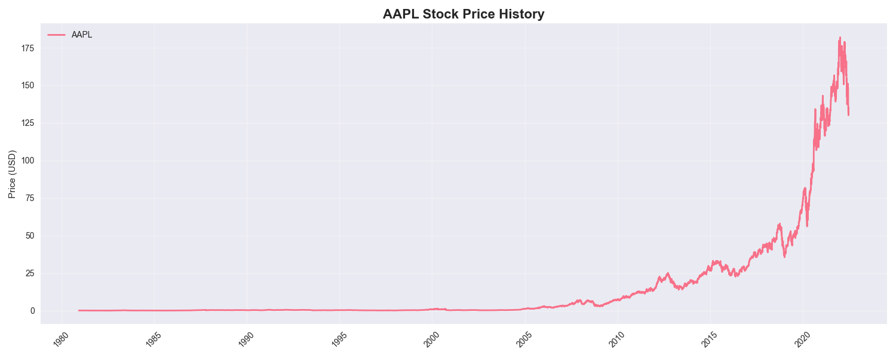
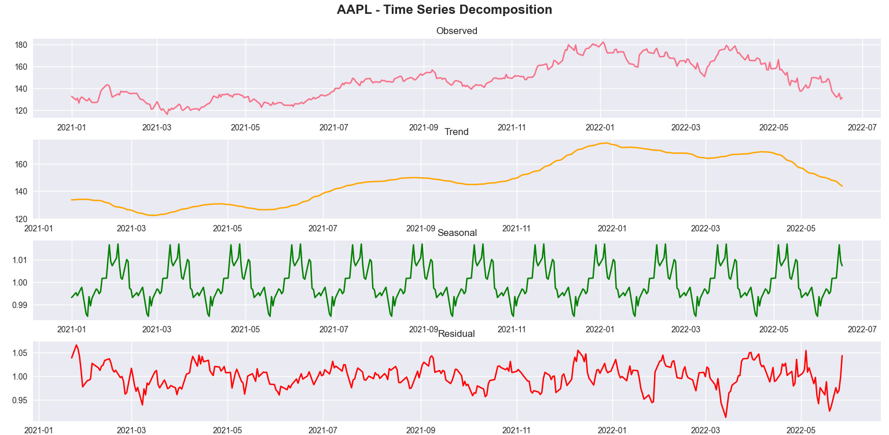
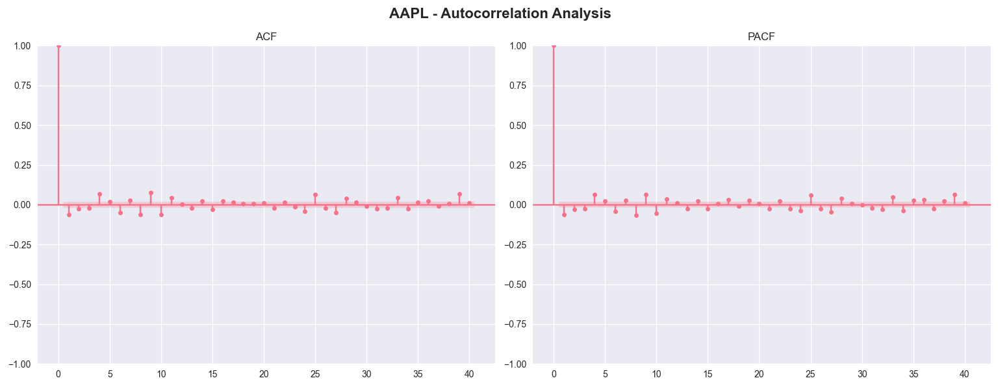
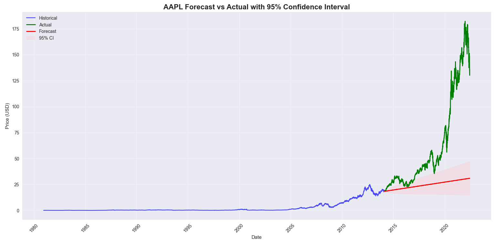
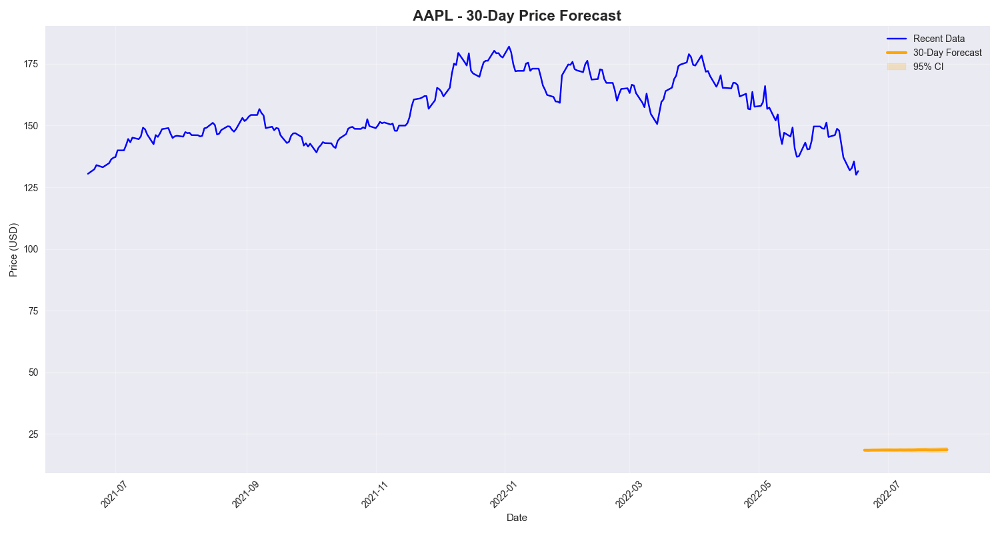
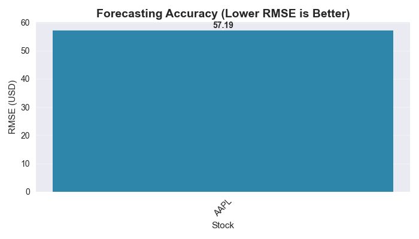

# Apple Stock Price Forecasting - Visualizations

This document provides detailed descriptions and insights into all visualizations created during the Apple Stock Price Forecasting project using ARIMA and SARIMA models.

---

## 1. AAPL Stock Price History Plot

**Description:**  
- Line chart showing the Apple stock closing prices over the full historical period from 1980 to 2022.
- Visualization of price trends, overall volatility, and major market phases.

**Insights:**  
- Provides an overview of long-term price movement and volatility.
- Helps identify periods of rapid growth or decline in stock value.

---

## 2. AAPL Time Series Decomposition

**Description:**  
- Multi-panel plot decomposing the time series into observed, trend, seasonal, and residual components.
- Seasonal decomposition assuming a roughly monthly cycle on business days.

**Insights:**  
- Trend shows long-term growth patterns in Apple stock price.
- Seasonal component captures repeating periodic fluctuations.
- Residual plot reveals unexplained noise and potential anomalies.

---

## 3. AAPL Autocorrelation Analysis

**Description:**  
- Plots showing autocorrelation (ACF) and partial autocorrelation (PACF) for differenced closing prices.
- Helps identify AR and MA model orders and detect seasonality.

**Insights:**  
- Significant lags guide parameter selection for ARIMA/SARIMA models.
- Seasonal spikes suggest monthly seasonal effects.

---

## 4. AAPL Forecast vs Actual with 95% Confidence Interval

**Description:**  
- Overlay plot of historical Apple closing prices, test set actual prices, and model forecasts.
- Includes 95% confidence intervals around forecasted values.

**Insights:**  
- Visual assessment of model accuracy and uncertainty.
- Reveals where predictions deviate most noticeably from true prices.

---

## 5. AAPL 30-Day Price Forecast

**Description:**  
- Forecast plot showing predicted closing prices for the next 30 business days.
- Shaded region indicates 95% confidence intervals depicting forecast uncertainty.
- Includes recent one-year actual data for context.

**Insights:**  
- Helps anticipate short-term price trends for investment decisions.
- Confidence band communicates risk and prediction reliability.

---

## 6. Forecast Accuracy Comparison

**Description:**  
- Bar chart comparing RMSE values of ARIMA and SARIMA models on AAPL stock.
- Provides a clear ranking of forecasting model performance.

**Insights:**  
- Lower RMSE indicates better forecast accuracy.
- Useful for selecting the most appropriate model for deployment.

---

## Notes

- All visualizations are saved as PNG files in the `/images/` directory.
- These plots are generated using `matplotlib` and `seaborn` within the forecasting pipeline.

---

Thank you for reviewing the data visualizations for the Apple Stock Price Forecasting project. These graphical analyses support understanding and validating the ARIMA and SARIMA time series models applied.
