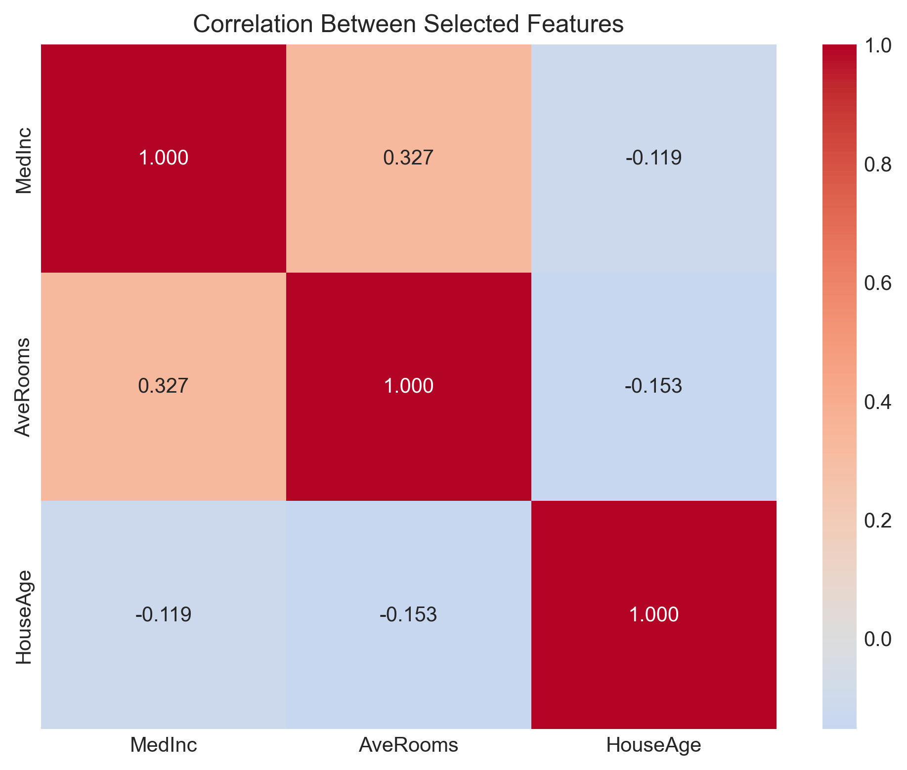
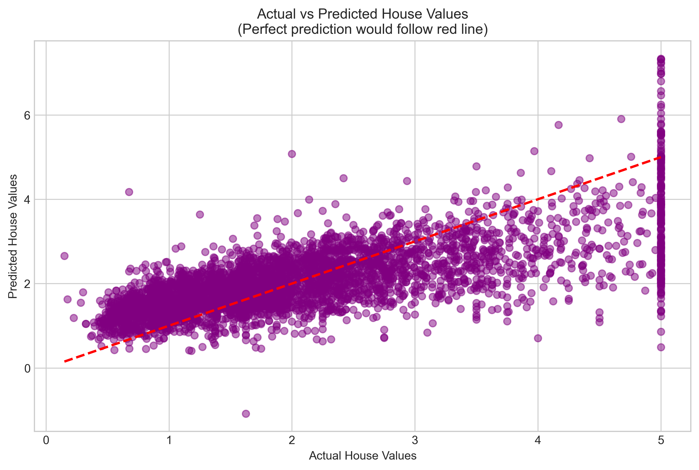
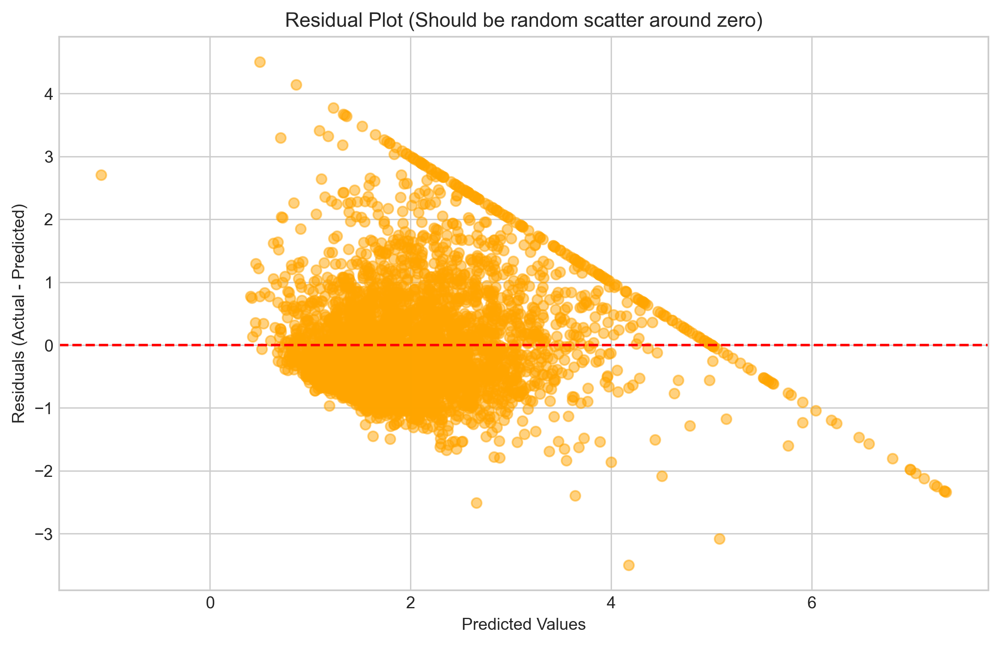
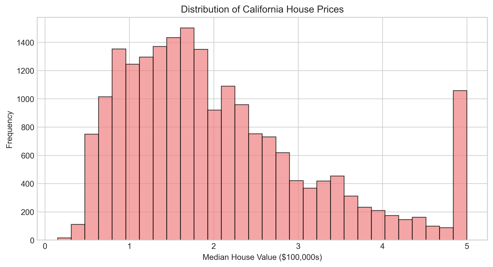
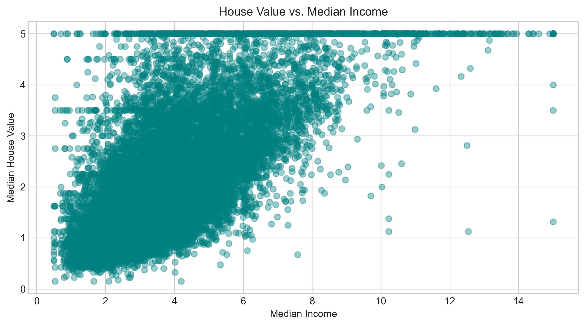

# Project Visualizations

## 1. Correlation Heatmap
Shows correlations between key features and the target variable.  

## 2. Actual vs Predicted Plot
Compares the predicted house prices to the actual prices from the test set.  

## 3. Residual Analysis
Visualizes residuals (errors) to check for biases or patterns.  

## 4. House Price Distribution
Displays the distribution of house prices in the dataset.  

## 5. Income vs House Value
Scatter plot showing the relationship between median income and house value.  

