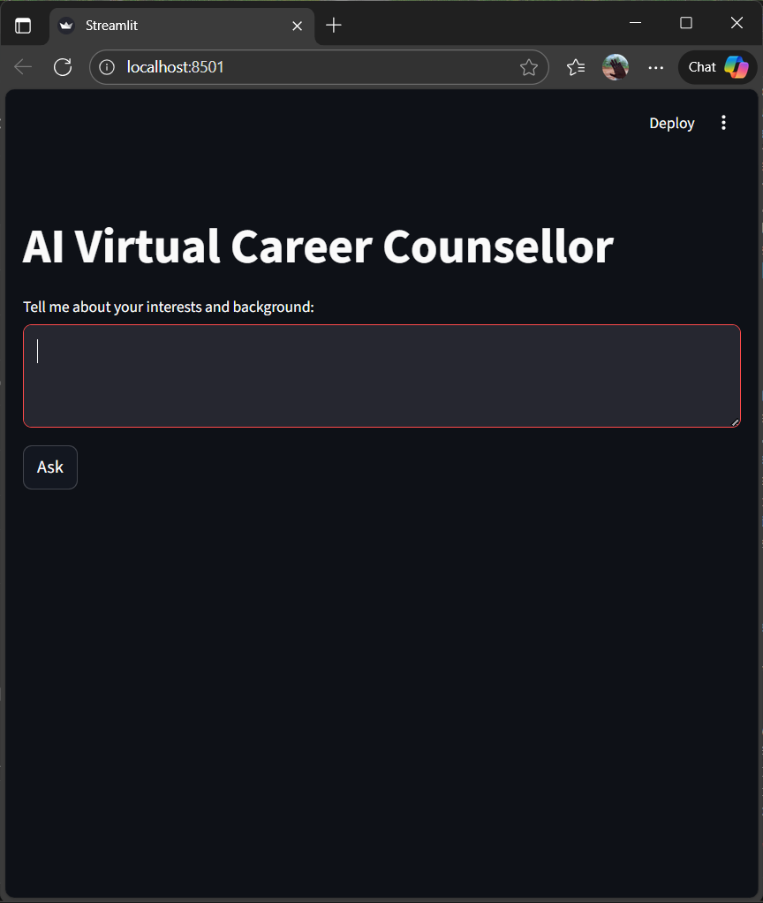
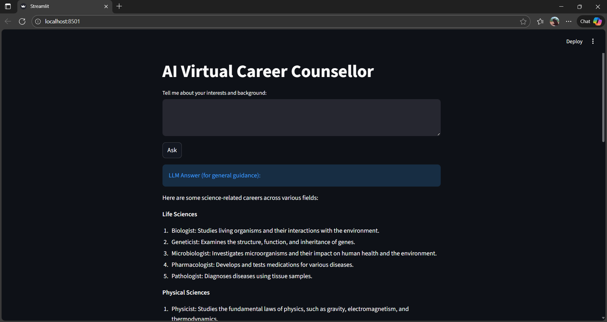
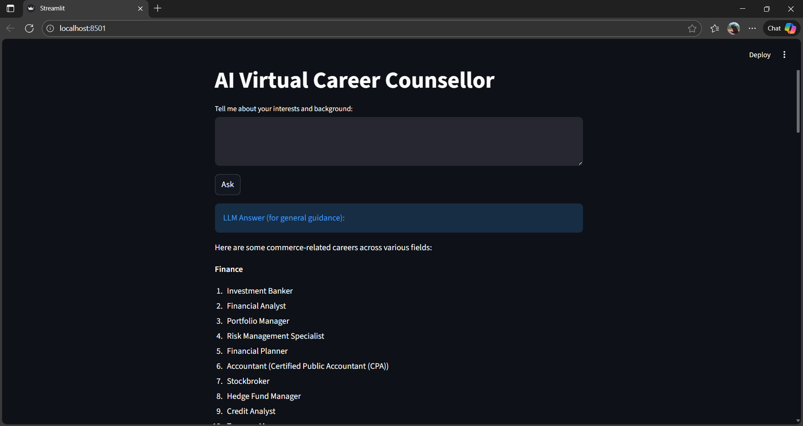
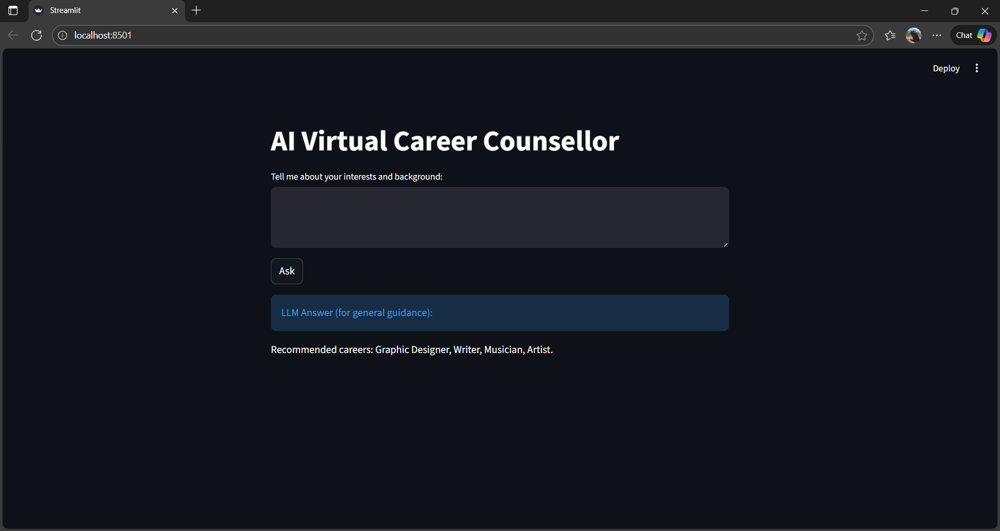

# AI Virtual Career Counsellor 

## Project Description

The AI Virtual Career Counsellor is an intelligent, interactive Streamlit web app designed to guide users toward ideal career paths using state-of-the-art Natural Language Processing and Large Language Model (LLM) technologies. Leveraging both rule-based intent detection and the power of Ollama's locally hosted Llama 3 model, it delivers personalized, immediate, and context-aware career guidance through a friendly chat interface.

***

## 1. Project Objective

Build a modern, hybrid AI career guidance system that can:

- Interpret user interests and backgrounds using keyword-based and generative NLP
- Match users to appropriate career pathways (Tech, Arts, Commerce, etc.)
- Engage users in personalized conversations with rich, contextual LLM-powered answers
- Provide both direct recommendations (for clear intents) and LLM fallback for nuanced or ambiguous queries
- Deliver a seamless, user-friendly chat UI with auto-clearing input for repeated use

***

## 2. Features

- **Interactive Streamlit UI:** Clean chat-style input/output with dark mode support and seamless user experience
- **Intent Extraction:** Fast, rules-driven keyword analysis for classic career domains
- **Ollama LLM Integration:** Local Llama 3.2:3B model serving context-aware fallback answers on your machine (fully private, no API cost)
- **Instant Input Reset:** Chatbox clears after each query for smooth multi-turn conversations
- **Modular Design:** Simple to extend with more career domains, models, or backend actions

***

## 3. Technology Stack

| Component      | Purpose                                      |
|----------------|----------------------------------------------|
| Streamlit      | Interactive web app UI                       |
| Python 3.9+    | Main programming environment                 |
| NLTK           | Intent extraction via tokenization/keywords  |
| Ollama         | Local LLM model serving for fallback answers |
| Llama 3.2:3B   | Cutting-edge local language model            |

***

## 4. Demo Screenshot

### 1. Welcome & Input Page


### 2. Example: Science Career Recommendation


### 3. Example: Commerce Career Recommendation


### 4. Example: Arts Career Recommendation



***
## 5. Detailed Methodology

### NLP Pipeline

- **1. Intent Classification:** User input is processed with NLTK to extract key domains (Tech, Arts, Commerce).
- **2. Direct Recommendation:** If an intent matches, the app displays tailored suggestions.
- **3. LLM Fallback:** For complex/no-match user queries, Ollama's Llama 3 model generates a detailed career message.

### UI Workflow

- User types their background/interests → clicks Ask
- App responds (recommendation or LLM text)
- Input clears for next interaction—ready for iterative Q&A

***

## 6. Project Setup and Requirements

### Requirements

- Python 3.9+
- pip packages: `streamlit`, `nltk`, `ollama`
- Ollama installed and running with the required Llama 3 model

### Installation

1. Clone the repo:
   ```bash
   git clone <repo-url>
   cd <project-directory>
   ```

2. Create a virtual environment and activate it:
   ```bash
   python -m venv venv
   .\venv\Scripts\activate  # Windows
   source venv/bin/activate  # macOS/Linux
   ```

3. Install dependencies:
   ```bash
   pip install streamlit nltk ollama
   ```

4. Download NLTK punkt data (first run only):
   ```python
   import nltk
   nltk.download('punkt')
   ```

5. Install Ollama and pull the Llama 3.2:3B model:
   ```bash
   ollama pull llama3.2:3b
   ollama serve
   ```

***

## 7. Running the App

```bash
streamlit run career_ui.py
```

- Open http://localhost:8501 in your browser.
- Start chatting with your AI career counsellor.

***

## 8. File Structure

| File             | Description                            |
|------------------|----------------------------------------|
| `career_ui.py`   | Main Streamlit and LLM application     |
| `requirements.txt` | Pip requirements                    |
| `README.md`      | This documentation                     |
| `screenshot.png` | (Add a screenshot of your app here)    |

***

## 9. Key Results & User Experience

- **Direct mapping for known domains:** Fast, actionable career matches for users with specific interests.
- **Natural conversation fallback:** Professional, human-like LLM answers guiding user self-exploration.
- **Optimized for speed:** No round-trip to cloud LLMs; runs privately and instantly on your machine.

***

## 10. Possible Extensions

- Add more domains (e.g., Medicine, Law, Sports) to `CAREER_KEYWORDS`
- Support multilingual queries and recommendations
- Integrate with a backend database for user session tracking or logging
- Deploy online via Streamlit Cloud or self-hosted server

***

## 11. Author & Contact

- **Author:** Ghanashyam T V
- **Email:** ghanashyamtv16@gmail.com
- **LinkedIn:** [linkedin.com/in/ghanashyam-tv](https://linkedin.com/in/ghanashyam-tv)

***

## 12. Acknowledgments

- Built using [Streamlit](https://streamlit.io/), [NLTK](https://www.nltk.org/), and [Ollama](https://ollama.com/)
- Inspiration: Academic and industry career guidance programs

***

**Thank you for using the AI Virtual Career Counsellor!**  
Feel free to fork, modify, and contribute 

***

You can further tailor this `README.md` by adding badges, a "Contributing" section, links to video walk-throughs, or business FAQ as appropriate for your use case and audience.
