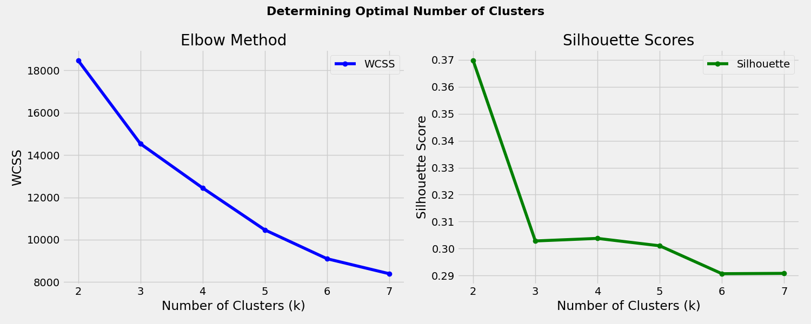
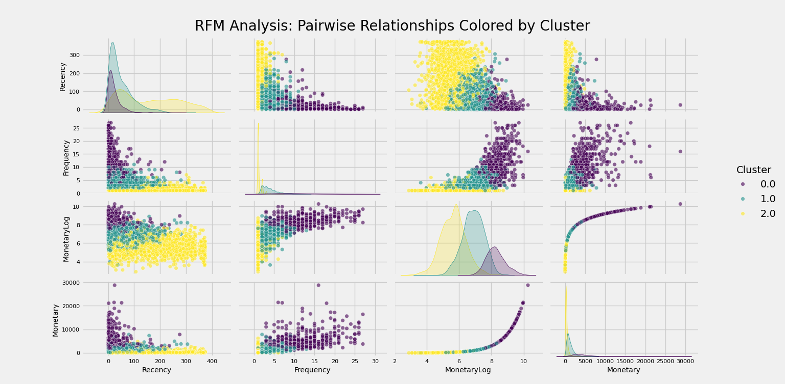

# Customer Segmentation - Visualizations

This document provides detailed descriptions and insights into all visualizations created during the Customer Segmentation project.

---

## 1. Elbow Method Plot

**Description:**  
Line plot showing Within-Cluster-Sum-of-Squares (WCSS) for various k values to identify optimal cluster count.

**Insights:**  
- Elbow point suggests k=3 offers a good trade-off between model complexity and cluster fit.

---

## 2. Silhouette Scores Plot

**Description:**  
Line plot of silhouette scores across different cluster counts, measuring cluster cohesion and separation.

**Insights:**  
- Highest score near k=3 confirms optimal cluster choice.

---

## 3. Customer Distribution Across Clusters

**Description:**  
Bar plot showing number of customers in each cluster after K-Means clustering.

**Insights:**  
- Balanced cluster sizes suitable for targeted marketing.

---

## 4. Cluster-wise Feature Relationships

**Description:**  
Grid of scatter plots depicting relationships between Recency, Frequency, Monetary values, Customer Lifetime, and Average Spend per Day, colored by cluster.

**Insights:**  
- Visually distinct grouping supports cluster validity.

---

## 5. Boxplot of Cluster Characteristics

**Description:**  
Boxplots for key features across clusters, illustrating distribution and variability.

**Insights:**  
- Highlights feature differences and customer segment profiles.

---

## 6. K-Means Clustering PCA Visualization

**Description:**  
Scatter plot of PCA-reduced features colored by cluster, with cluster centers marked.

**Insights:**  
- Clusters are well-separated in lower dimensional space, validating segmentation.

---

## 7. DBSCAN Clustering Visualization

**Description:**  
Scatter plot of DBSCAN clusters on a subset of scaled data, identifying core points and noise (-1 label).

**Insights:**  
- Identifies noise customers and different cluster shapes compared to K-Means.

---

## 8. Boxplot of Monetary Values (Outliers)

**Description:**  
Boxplot showing distribution and outliers for monetary values.

**Insights:**  
- Highlights skew and necessity of log transformation.

---

## 9. RFM Feature Distributions

**Description:**  
Histograms of Recency, Frequency, and Monetary features displaying the data distribution.

**Insights:**  
- Shows skewness and spread of customer metrics.

---

## 10. Monetary Value Original vs Log-Transformed

**Description:**  
Side-by-side histograms comparing raw and log-transformed Monetary values.

**Insights:**  
- Log transform reduces right skew, normalizing data for clustering.

---

## 11. Pairplot of RFM Features

**Description:**  
Pairplot visualizing pairwise relationships among RFM features, colored by cluster.

**Insights:**  
- Reveals how clusters separate across feature combinations.

---

## 12. Cluster Distribution by Top 5 Countries

**Description:**  
Stacked bar chart showing cluster percentages within top 5 customer countries.

**Insights:**  
- Geographic variation in cluster composition.

---

*Note:* All images are stored in the `/images/` directory.

---

