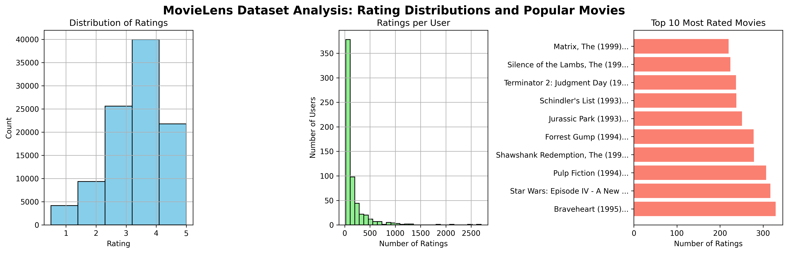
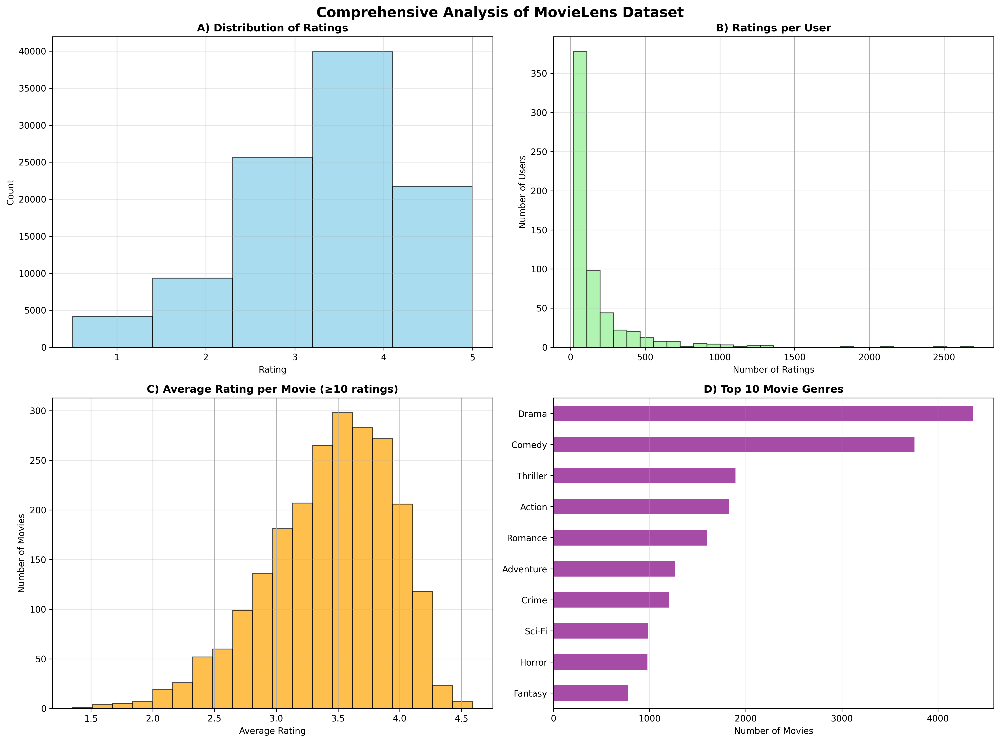
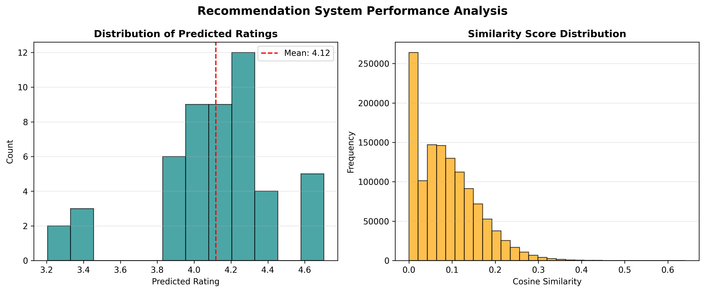
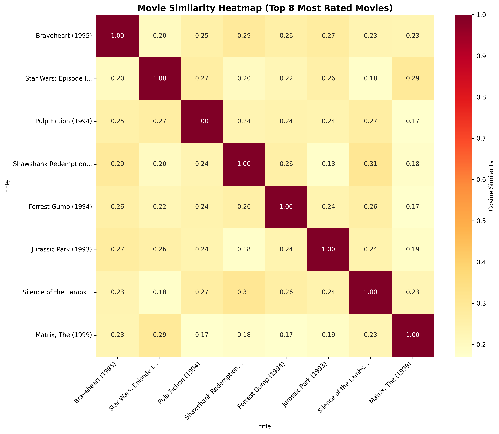

# Movie Recommendation System - Visualizations

This document provides detailed descriptions and insights into all visualizations created during the MovieLens Recommendation System project.

---

## 1. MovieLens Dataset Analysis: Rating Distributions and Popular Movies Plot

**Description:**  
- **Distribution of Ratings**: Histogram showing how user ratings fall mostly between 3 and 4 stars.
- **Ratings per User**: Most users rate between 1 and 100 movies with few highly active users.
- **Top 10 Most Rated Movies**: Bar chart showing most rated movies including classics like Matrix and Pulp Fiction.

**Insights:**  
- Ratings tend to cluster around 3-4 stars, indicating a generally positive user rating behavior.
- User engagement varies significantly with some super-users rating many movies.
- Popular movies receive substantial user attention and can act as pivot points in recommendations.

---

## 2. Comprehensive Analysis of MovieLens Dataset Plot

**Description:**  
Multi-panel analysis including rating distribution, ratings per user, average ratings per movie (only movies with ≥10 ratings), and top 10 movie genres by count.

**Insights:**  
- Average ratings are mostly between 3 and 4 stars for well-rated movies.
- Drama and Comedy dominate the genre distribution.
- Data quality is ensured by filtering less-rated movies/users.

---

## 3. Recommendation System Performance Analysis Plot

**Description:**  
- **Distribution of Predicted Ratings**: Histogram of recommendations scores with mean around 4.1 suggesting strong preferences.
- **Similarity Score Distribution**: Histogram showing cosine similarities are concentrated low, indicating varied movie tastes.

**Insights:**  
- Recommendation system tends to predict high ratings for top candidates.
- Users' preferences are diverse as seen with cosine similarity spread.

---

## 4. Movie Similarity Heatmap (Top 8 Most Rated Movies) Plot

**Description:**  
Heatmap of cosine similarity scores between top-rated, frequently rated movies.

**Insights:**  
- Moderate to low similarity scores indicate variety even among most popular movies.
- Useful visualization for recommending movies with similar tastes.

---

*Note:* All images are stored in the `/images/` directory.

---

